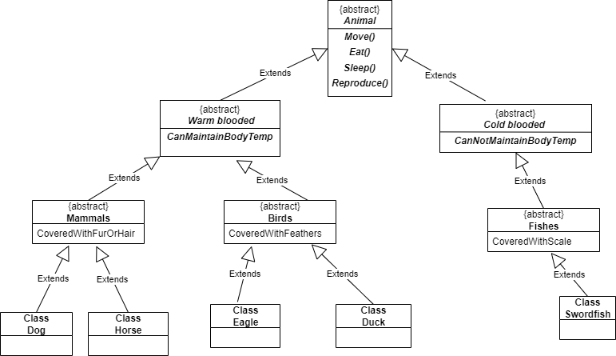

# lab06-Zoo

This app represents a Zoo that has 3 type of animals Maamals, Birds and Fishes.
From Mammals we have dogs and horses, from birds we have eagls and ducks and from fishes we have swordfishes.

In Dog class :

- I overrde 4 abstract methods
- I override 2 virtual methods
- I override 2 virtual properties

In  Swordfish class

- I override two abstract properties

In Program class 

- I used polymorphism (Dog husky = new SiberianHusky();)

